STD Daten 2020
================
Bernard Surial
29\. Januar 2021

# Chlamydien

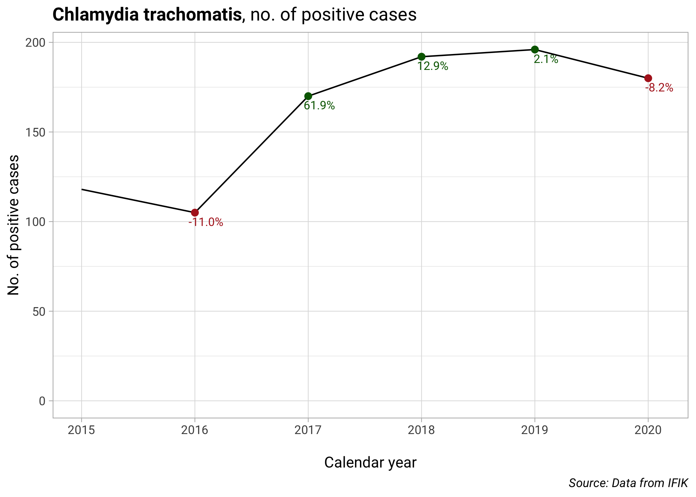<!-- --><!-- -->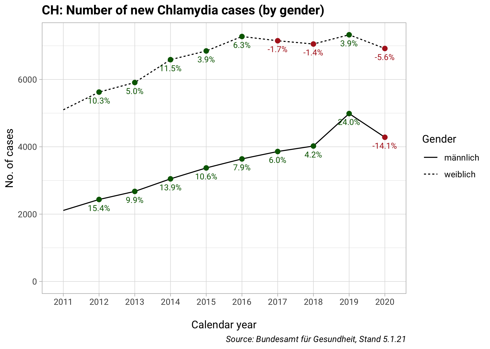<!-- -->

# Gonokokken

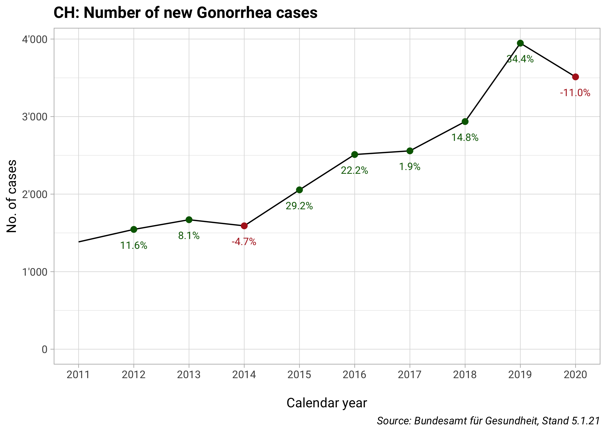<!-- -->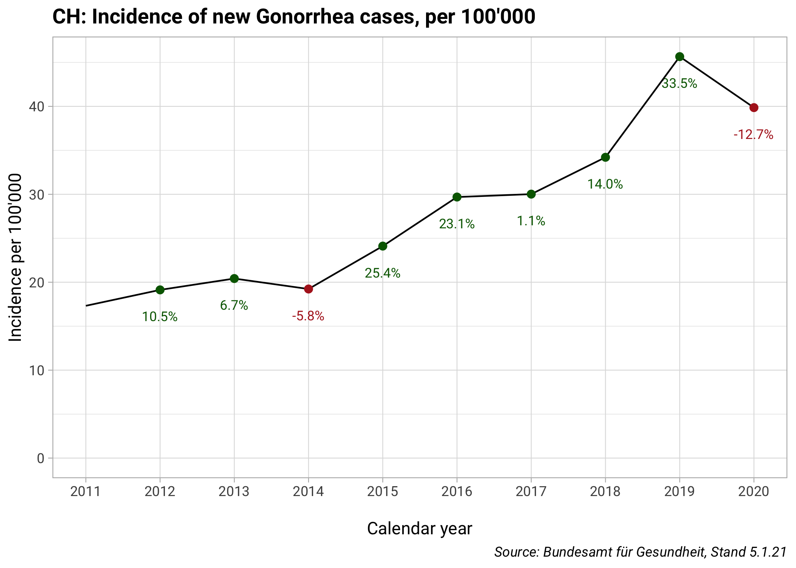<!-- -->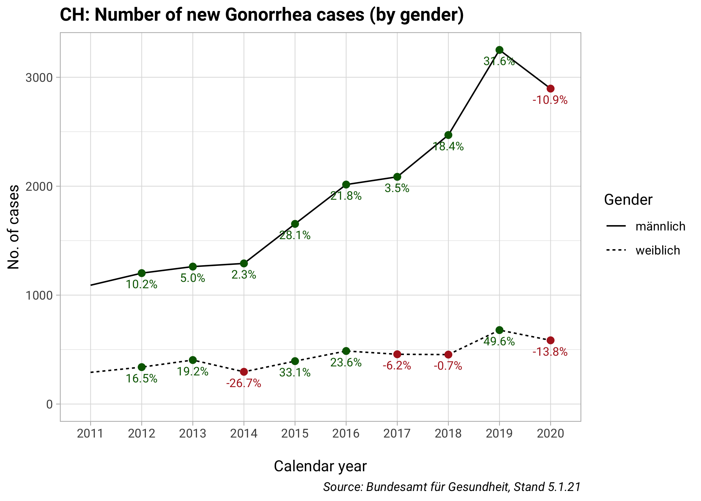<!-- -->

# HIV

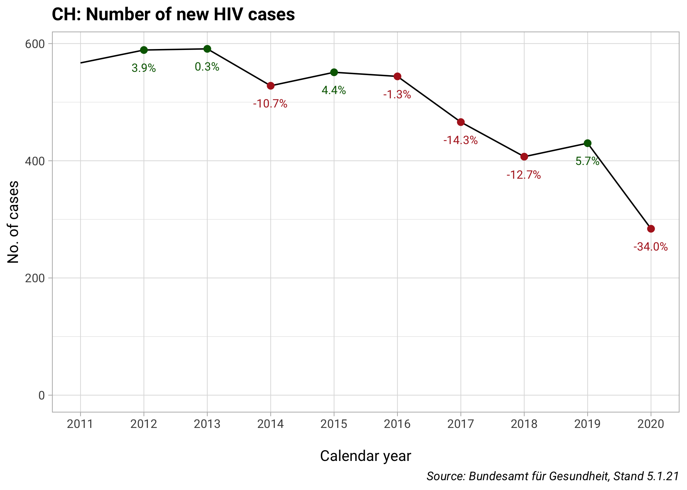<!-- -->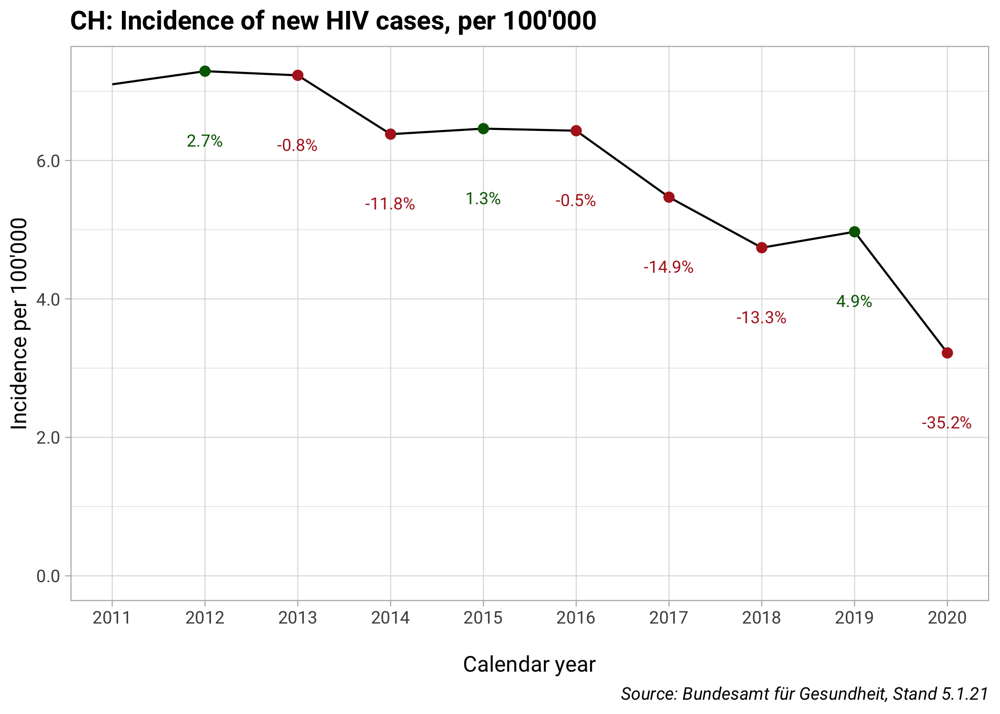<!-- --><!-- -->

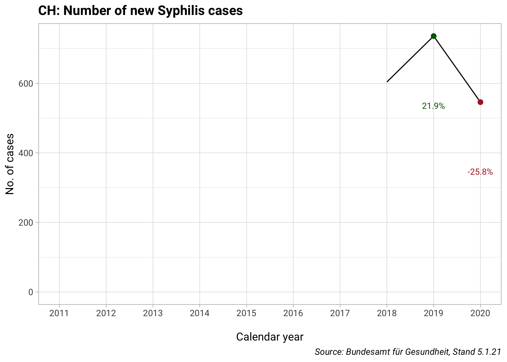<!-- -->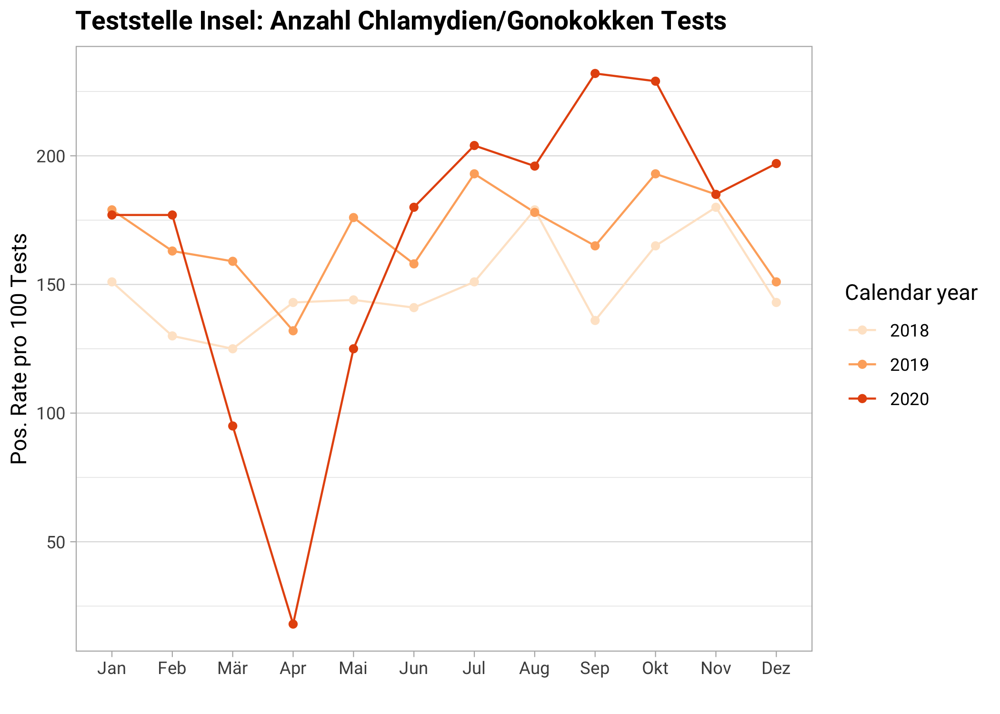<!-- -->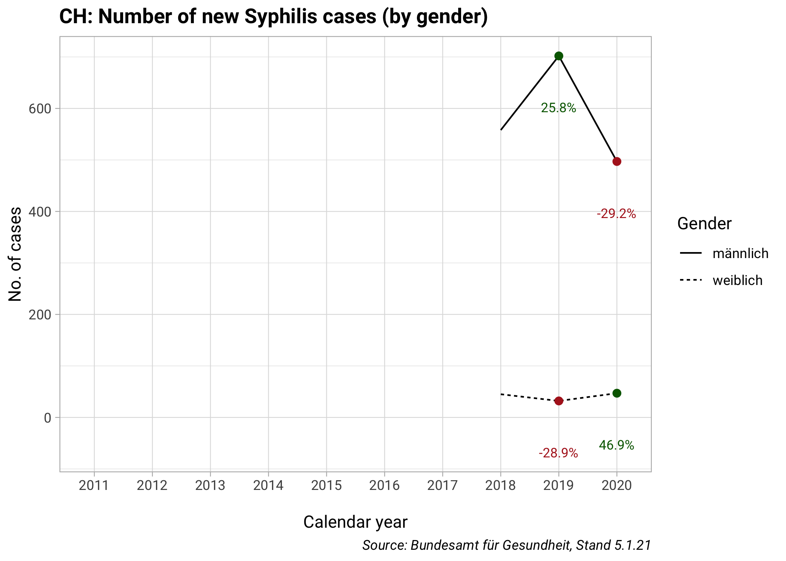<!-- -->

# Daten der Teststelle

<!-- -->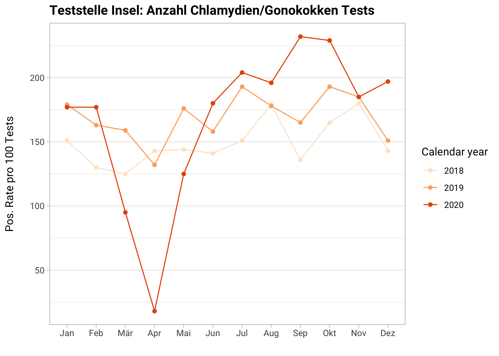<!-- -->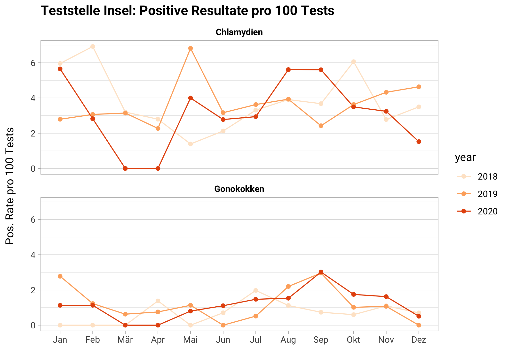<!-- -->
