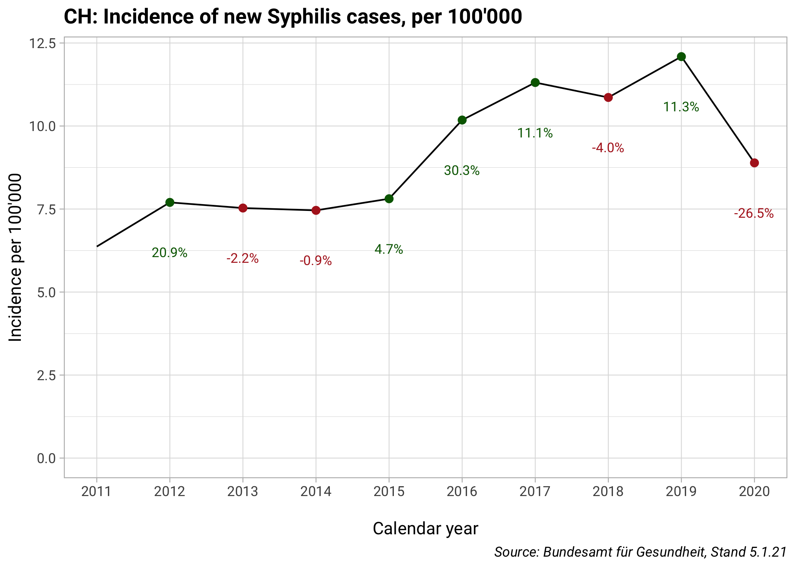
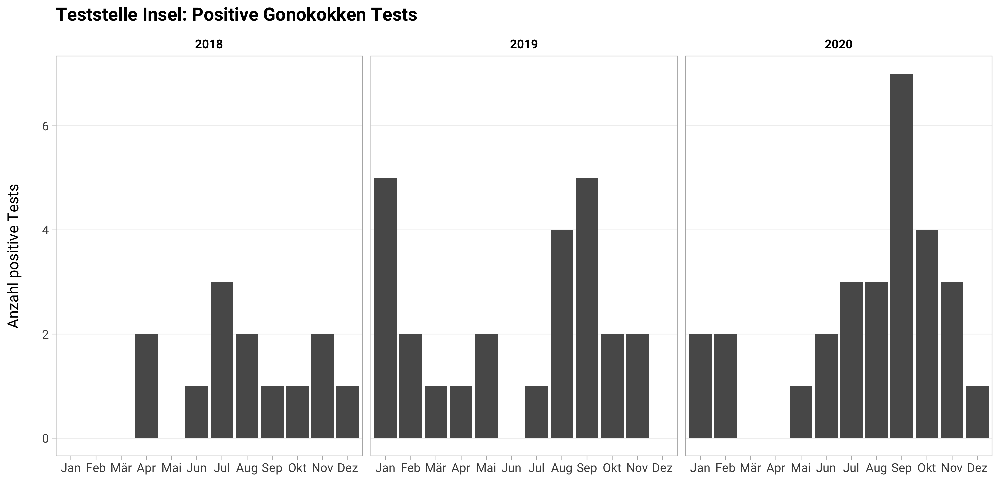
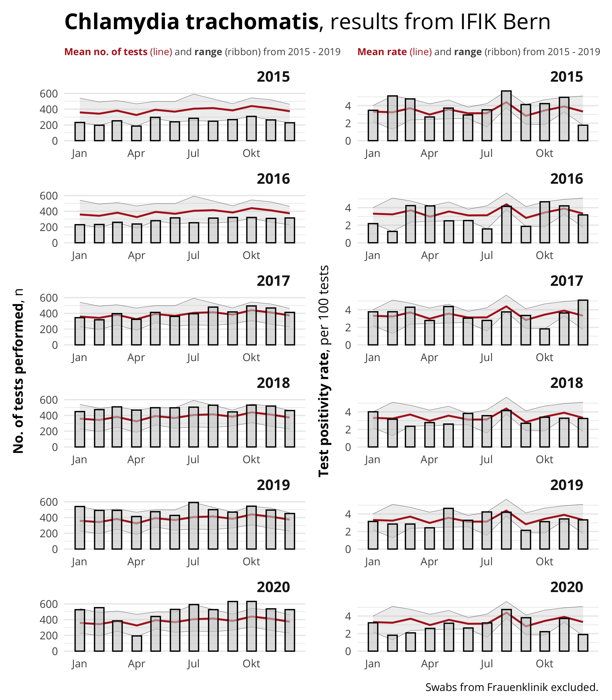

STD Daten 2020
================
Bernard Surial
11. Februar 2021

# Chlamydien

<!-- --><!-- --><!-- -->

# Gonokokken

<!-- --><!-- --><!-- -->

# HIV

<!-- --><!-- --><!-- -->

# Syphilis

<!-- --><!-- --><!-- -->

# Daten der Teststelle

<!-- --><!-- --><!-- -->

<!-- --><!-- -->

# Daten vom IFIK

<!-- -->

<!-- -->
